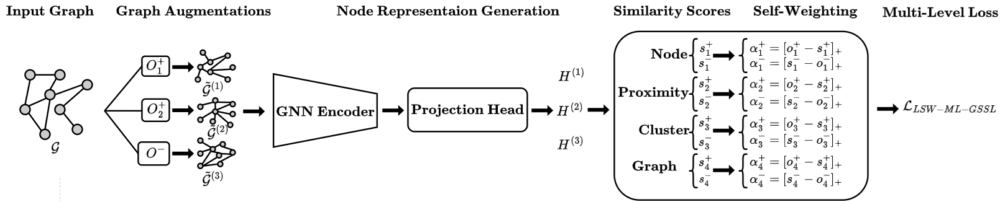

# A Unified Perspective for Learning Graph Representations Across Multi-Level Abstractions
Graph Self-Supervised Learning (GSSL) has emerged as a powerful paradigm for generating high-quality representations for graph-structured data. However, many existing methods focus on a single graph abstraction level, which limits their ability to generalize effectively across diverse downstream tasks. To address this limitation, we propose a unified contrastive framework that can target node-level, proximity-level, cluster-level, and graph-level information and integrate them through a linear combination of similarity and dissimilarity scores. Furthermore, current approaches typically assign uniform penalty strengths to all examples, which reduces optimization flexibility and leads to ambiguous convergence status. To overcome this, we introduce a novel learnable fine-grained self-weighting mechanism that adaptively assigns weights to individual similarity and dissimilarity scores. The proposed mechanism emphasizes the scores that deviate significantly from the optimum targets. Our approach not only enhances optimization flexibility but also eliminates the computational overhead associated with hyperparameter tuning in conventional multi-task GSSL methods. Comprehensive experiments on six real-world datasets show that our methods consistently outperform state-of-the-art approaches across downstream tasks, including classification, clustering, and link prediction, in both single-level and multi-level scenarios.

# Architecture


# Requirements 
Installing the requirements using pip 

```
$ pip install -r requirements.txt
```

# Node Classifiction and Node Clustering
```
$ python eval_multi_level.py --dataset=cora --device_number=1 --m=0.1 --gamma=1.5
```

# Edge Prediction
```
$ python linkp_multi_level.py --dataset=cora --device_number=1
```
